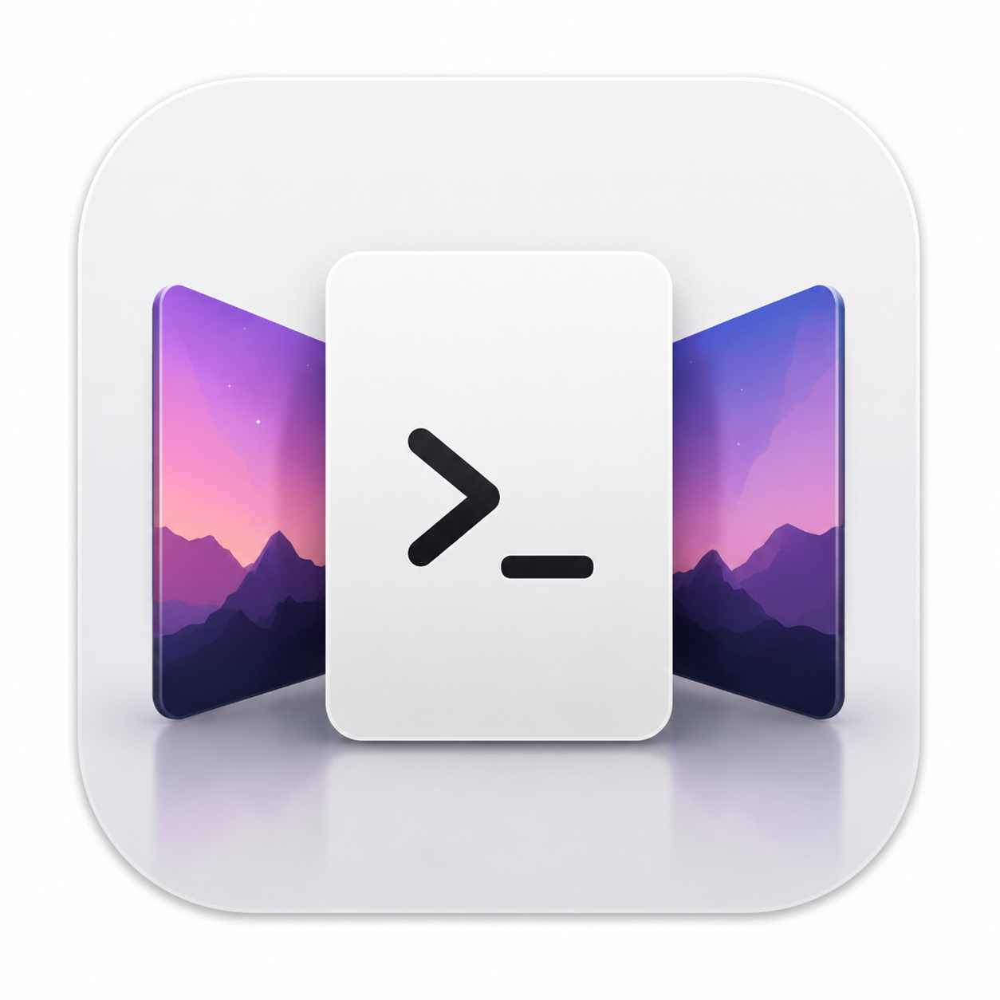
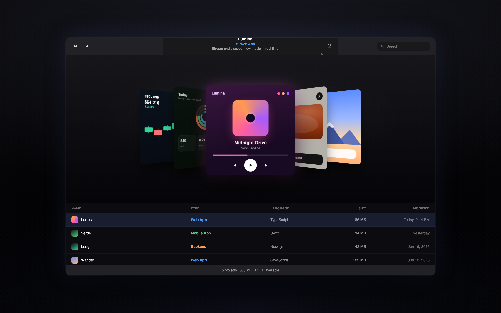
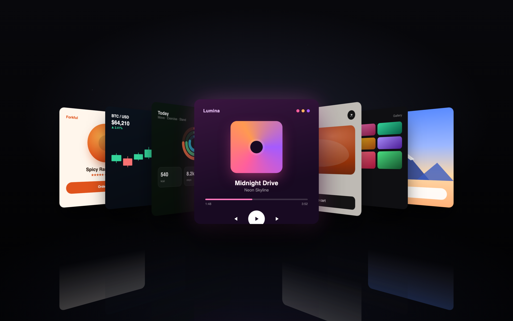
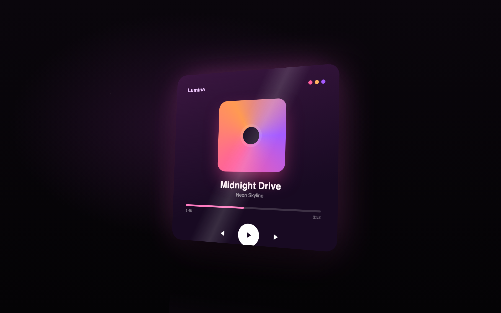
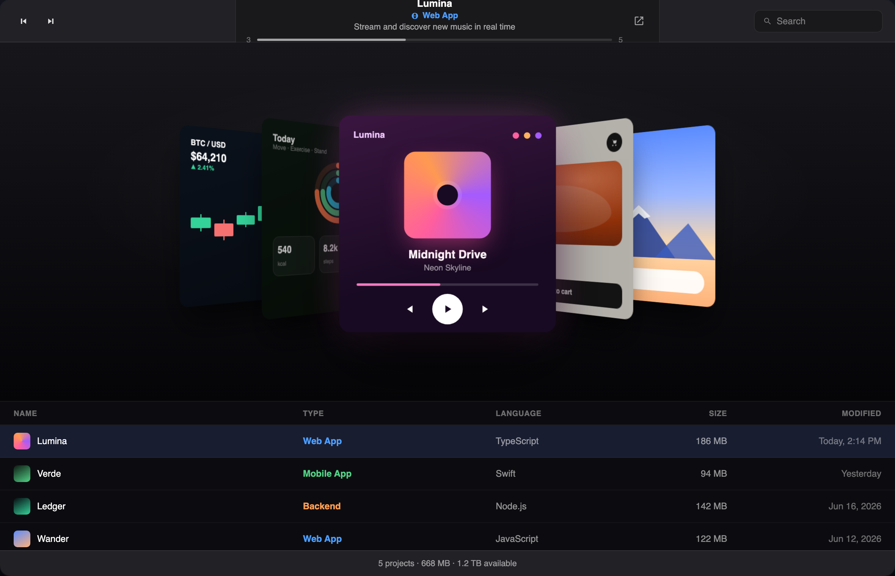

<div align="center">



# iProject

### Your projects, worth looking at.

A native macOS browser for your dev folders — with a real iTunes-style Cover Flow at its heart. Every project becomes an album. Flip through them.



<br/>


</div>

---

## A folder full of work. None of it worth a second glance.

Finder lists your projects as rows of identical blue folders. Names, dates, sizes. It tells you *what's there*. It never makes you *want to open it*.

iProject takes the same folder and turns it into something you actually enjoy flipping through. The frontend you shipped becomes the cover. The dashboard you built becomes the cover. And when there's nothing visual to show, iProject reads the project's structure and writes the cover for you. Nothing is ever blank.

<div align="center">

</div>

---

## Cover Flow. The real one.

This is the part we obsessed over. A single spring drives the entire flow, so every key press, every flick, every drag stays coherent — interrupt it mid-motion and it simply catches the next card. Covers fan out to fifty degrees, recede in depth, dim toward the edges, and cast a soft reflection on the floor below.

It feels like flipping records. There's even a sound — a light, precise tick on every step, tuned by hand until it felt right.

- **Spring-driven** — `mass 1, stiffness 150, damping 30`. One animated value, chased smoothly.
- **Flip by anything** — arrow keys, click a side cover, or grab and drag the whole stack.
- **Tactile audio** — a soft 1.5 kHz tick per step, volume scaled to how fast you flick. Mutable, of course.

---

## Covers made of real work.

<table>
<tr>
<td width="50%" valign="top">

**Real screens first.**
iProject scans each project for its actual frontend or GUI — a rendered page, a screenshot, an interface — and crops it into a square cover. Your work, on the shelf.

</td>
<td width="50%" valign="top">

**Generated when needed.**
No visual to find? iProject detects the framework, classifies the project, and composes a cover from its metadata. Every project gets one. No exceptions.

</td>
</tr>
</table>

<div align="center">

</div>

---

## Everything else you'd expect from a Mac app.

| | |
|---|---|
| **Finder-style list** | Sortable columns — name, type, language, size, modified — right under the stage. |
| **Smart collections** | A sidebar that groups by kind, favorites, recent, and this week. |
| **Open anywhere** | Launch a project straight into Claude Code, Cursor, Codex, or reveal it in Finder. |
| **Always described** | Pulls from the README or manifest, and writes a description from structure when there isn't one. |
| **Any workspace** | Point it at any folder. Everything adapts — no hardcoded paths, no assumptions. |
| **Your covers** | Don't like an auto cover? Drop in your own image. One click to reset. |

<div align="center">

</div>

---

## Install

iProject is a native SwiftUI app. Build it from source in about a minute.

**Requirements** — macOS 14 (Sonoma) or later, Xcode 15+, and [XcodeGen](https://github.com/yonaskolb/XcodeGen).

```bash
# 1. Clone
git clone https://github.com/hitgub616/iProject.git
cd iproject

# 2. Generate the Xcode project
brew install xcodegen   # if you don't have it
xcodegen generate

# 3. Build & run
open iProject.xcodeproj
#   ⌘R in Xcode — or build from the command line:
xcodebuild -project iProject.xcodeproj -scheme iProject \
  -configuration Release CODE_SIGNING_ALLOWED=NO build
```

On first launch, point iProject at the folder where your projects live. It scans, classifies, and starts rendering covers in the background.

---

## How it works

A quick tour for the curious.

- **`Views/CoverFlowView.swift`** — the Cover Flow stage. One `position` value, one spring, drag + keyboard input.
- **`Design/Theme.swift`** — the Cover Flow geometry and the app's color system. The motion constants live here.
- **`Services/ProjectScanner.swift`** — classifies each project (web, mobile, backend, data/ML…) and composes a description.
- **`Services/CoverResolver.swift`** — scores candidate screenshots and builds square thumbnails.
- **`Services/WebPreviewRenderer.swift`** — renders a project's web frontend off-screen to use as its cover.
- **`Audio/TickPlayer.swift`** — the flip sound. A six-voice pool so rapid steps overlap instead of cutting off.

Built with SwiftUI, the Observation framework, AVFoundation, and WebKit. No third-party dependencies.

---

## License

[MIT](LICENSE) — do what you like.

<div align="center">
<br/>
<sub>Made for people with too many side projects.</sub>
</div>
